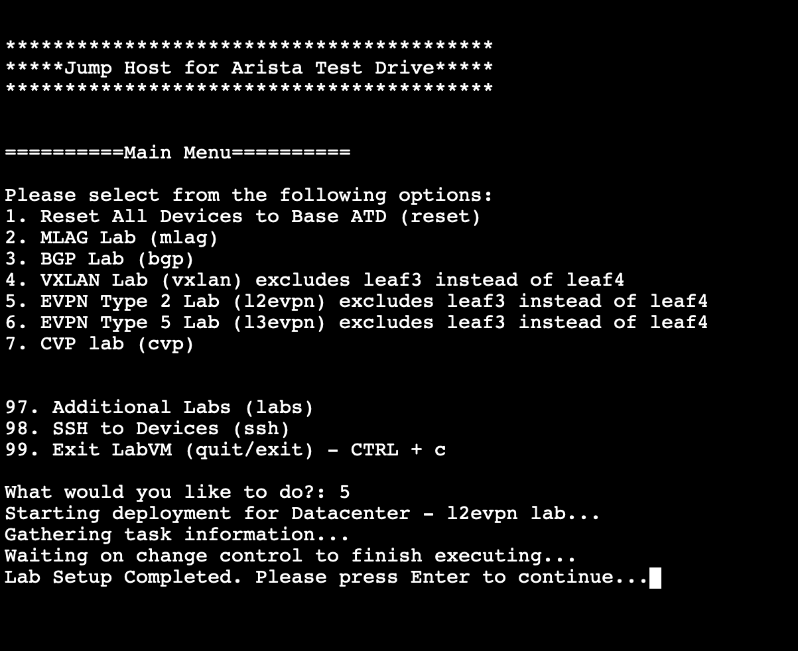
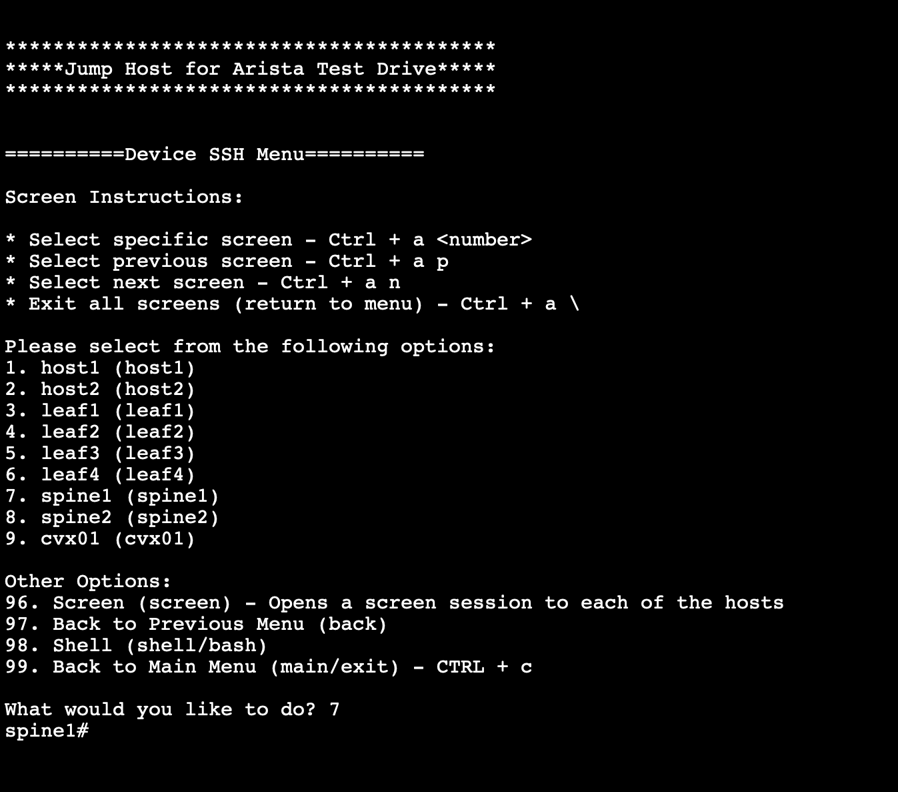
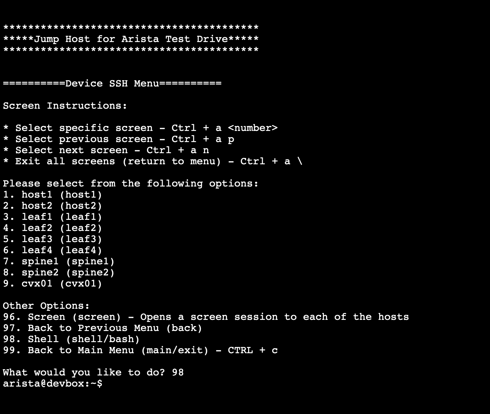

Lets use this repository with an ATD (Arista Test Drive) lab.

## Set up an ATD instance

Login to the Arista Test Drive portal, create and start an instance.

Here's the ATD topology:


Load the EVPN lab from ATD:



This lab uses 2 spines and 2 leaves:
- Spine1 and spine2
- Leaf1 and leaf3

Leaf2 and leaf4 are not used.

Here's the EVPN lab topology:


The script configured the lab with the exception of leaf3:
- eBGP is configured between spines and leaves (underlay, IPv4 address family).
- BFD is configured for the eBGP sessions (IPv4 address family)
- Leaves <-> spines interfaces are configured with an IPv4 address.
- EVPN is configured.
- eBGP is configured between spines and leaves (overlay, EVPN address family).
- VXLAN is configured on the leaves.
- 2 loopback interfaces are configured per leaf.
- 1 loopback interface is configured per spine.
- Default VRF only.
- No MLAG, ISIS, OSPF, IPv6, RTC, L3 multicast ...

Check the state of spine1:



```
spine1#show ip bgp summary
spine1#show bgp evpn summary
spine1#sh lldp neighbors
```
Some BGP sessions are not established because Leaf3 is not yet configured.
## Clone the repository

Use the devbox shell and clone the repository:


```
git clone https://github.com/arista-netdevops-community/network_tests_automation.git
cd network_tests_automation
```

## Check the inventory files

Run these commands using the devbox shell:
```
ls demo/inventory
more demo/inventory/all.txt
more demo/inventory/spines.txt
more demo/inventory/leaves.txt
```
## Install the requirements

Run these commands on devbox:
```
pip install -r requirements.txt
pip install -r requirements-dev.txt
```
```
pip list
```

## Install some additionnal tools

Run these commands on devbox:
```
sudo apt-get install tree
sudo apt install unzip
```

## Check requirements on the switches

```
spine1#show management api http-commands
```

## Test devices reachability using EAPI

Start a python interactive session on devbox:
```
arista@devbox:~$ python
```
Run these python commands:
```
from jsonrpclib import Server
import ssl
ssl._create_default_https_context = ssl._create_unverified_context
username = "arista"
# use the device password of your ATD instance
password = "aristaoy21"
ip = "192.168.1.10"
url = "https://" + username + ":" + password + "@" + ip + "/command-api"
switch = Server(url)
result=switch.runCmds(1,['show version'], 'text')
print(result[0]['output'])
exit()
```

## Test devices reachability

Run these commands on devbox:
```
python ./check-devices-reachability.py --help
python ./check-devices-reachability.py -i demo/inventory/all.txt -u arista
```

## Collect commands output from EOS devices

Run these commands on devbox:
```
python ./collect-eos-commands.py --help
more demo/eos-commands.yaml
python ./collect-eos-commands.py -i demo/inventory/all.txt -c demo/eos-commands.yaml -o demo/outdir -u arista
tree demo/outdir/
more demo/outdir/192.168.0.10/text/show\ version
more demo/outdir/192.168.0.10/json/show\ version
```

## Clear counters on EOS devices

```
spine1#sh interfaces counters
```
Run these commands on devbox:
```
python ./clear_counters.py --help
python ./clear_counters.py -i demo/inventory/all.txt -u arista
```
Note: The script includes also the EOS command `clear hardware counter drop` which is not implemented on vEOS/cEOS.
```
spine1#sh interfaces counters
```

## Clear on devices the list of MAC addresses which are blacklisted in EVPN

```
spine1#show bgp evpn host-flap
spine1#show logging | grep EVPN-3-BLACKLISTED_DUPLICATE_MAC
```
Run this command on devbox:
```
python ./evpn-blacklist-recovery.py --help
```
```
spine1#show bgp evpn host-flap
```

## Collect the scheduled show tech-support files from EOS devices

```
spine1#sh running-config all | grep tech
spine1# bash ls /mnt/flash/schedule/tech-support/
```
Run these commands on devbox:
```
python ./collect_sheduled_show_tech.py --help
python ./collect_sheduled_show_tech.py -i demo/inventory/all.txt -u arista -o demo/outdir
ls demo/outdir
unzip demo/outdir/xxxx.zip -d demo/outdir/
ls demo/outdir/mnt/flash/schedule/tech-support/
```
```
spine1# bash ls /mnt/flash/schedule/tech-support/
```

## Run tests on devices

Run these commands on devbox:
```
python ./check-devices.py --help
```
```
ls inventory
more inventory/all.txt
more inventory/spines.txt
more inventory/leaves.txt
```

ATD uses cEOS or vEOS so we will skip the hardware tests.
This lab doesnt use MLAG, OSPF, IPv6, RTC ... so we will skip these tests as well.

Some tests can be used for all devices, some tests can be used only for the spines, and some tests can be used only for the leaves.

```
ls tests
more tests/all.yaml
more tests/spines.yaml
more tests/leaves.yaml
```
```
python ./check-devices.py -i demo/inventory/all.txt -t demo/tests/all.yaml -o demo/all_results.txt -u arista
cat demo/all_results.txt
```
```
python ./check-devices.py -i demo/inventory/spines.txt -t demo/tests/spines.yaml -o demo/spines_results.txt -u arista
cat demo/spines_results.txt
```
```
python ./check-devices.py -i demo/inventory/leaves.txt -t demo/tests/leaves.yaml -o demo/leaves_results.txt -u arista
cat demo/leaves_results.txt
```