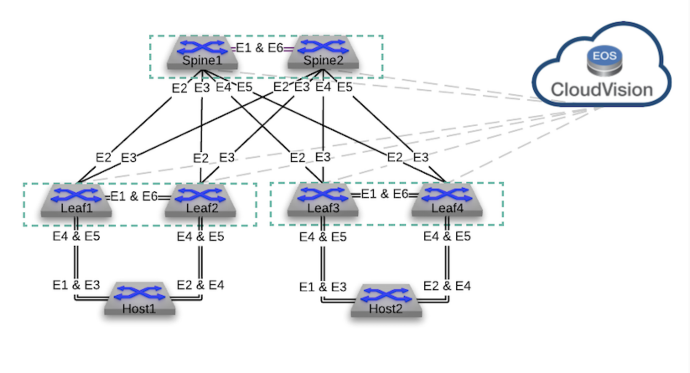
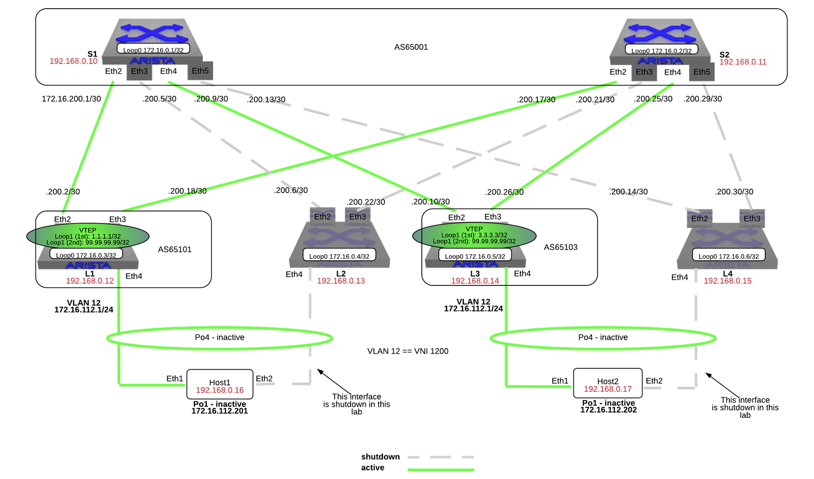

Lets use this repository with an ATD (Arista Test Drive) lab.

## Set up an ATD instance

Login to the Arista Test Drive portal, create and start an instance.

Here's the ATD topology:



Load the EVPN lab from ATD:


This lab uses 2 spines and 2 leaves:
- Spine1 and spine2
- Leaf1 and leaf3

Leaf2 and leaf4 are not used.

Here's the EVPN lab topology:


The script configured the lab with the exception of leaf3:
- eBGP is configured between spines and leaves (underlay, IPv4 address family).
- BFD is configured for the eBGP sessions (IPv4 address family)
- Leaves <-> spines interfaces are configured with an IPv4 address.
- EVPN is configured.
- eBGP is configured between spines and leaves (overlay, EVPN address family).
- VXLAN is configured on the leaves.
- 2 loopback interfaces are configured per leaf.
- 1 loopback interface is configured per spine.
- Default VRF only.
- No MLAG, ISIS, OSPF.

Check the state of spine1:


## Clone the repository

Use the devbox shell and clone the repository:


```
git clone https://github.com/arista-netdevops-community/network_tests_automation.git
cd network_tests_automation
```

## Check the inventory files

Run these commands using the devbox shell:
```
more examples/all.txt
more examples/spines.txt
more examples/leaves.txt
```
## Install the requirements

Run these commands on devbox:
```
pip install -r requirements.txt
pip install -r requirements-dev.txt
```
```
pip list
```

## Install some additionnal tools

Run these commands on devbox:
```
sudo apt-get install tree
sudo apt install unzip
```

## Check requirements on the switches

```
spine1#show management api http-commands
```

## Test devices reachability using EAPI

Start a python interactive session on devbox:
```
arista@devbox:~$ python
```
Run these python commands:
```
from jsonrpclib import Server
import ssl
ssl._create_default_https_context = ssl._create_unverified_context
username = "arista"
# use the device password of your ATD instance
password = "aristaoy21"
ip = "192.168.1.10"
url = "https://" + username + ":" + password + "@" + ip + "/command-api"
switch = Server(url)
result=switch.runCmds(1,['show version'], 'text')
print(result[0]['output'])
exit()
```

## Test devices reachability

Run these commands on devbox:
```
python ./check-devices-reachability.py --help
python ./check-devices-reachability.py -i examples/all.txt -u arista
```

## Collect commands output from EOS devices

Run these commands on devbox:
```
python ./collect-eos-commands.py --help
more examples/eos-commands.yaml
python ./collect-eos-commands.py -i examples/all.txt -c examples/eos-commands.yaml -o examples/outdir -u arista
tree examples/outdir/
more examples/outdir/192.168.0.10/text/show\ version
more examples/outdir/192.168.0.10/json/show\ version
```

## Clear counters on EOS devices

```
spine1#sh interfaces counters
```
Run these commands on devbox:
```
python ./clear_counters.py --help
python ./clear_counters.py -i examples/all.txt -u arista
```
Note: The script includes also the EOS command `clear hardware counter drop` which is not implemented on vEOS/cEOS.
```
spine1#sh interfaces counters
```

## Clear on devices the list of MAC addresses which are blacklisted in EVPN

```
spine1#show bgp evpn host-flap
spine1#show logging | grep EVPN-3-BLACKLISTED_DUPLICATE_MAC
```
Run this command on devbox:
```
python ./evpn-blacklist-recovery.py --help
```
```
spine1#show bgp evpn host-flap
```

## Collect the scheduled show tech-support files from EOS devices

```
spine1#sh running-config all | grep tech
spine1# bash ls /mnt/flash/schedule/tech-support/
```
Run these commands on devbox:
```
python ./collect_sheduled_show_tech.py --help
python ./collect_sheduled_show_tech.py -i examples/all.txt -u arista -o examples/outdir
ls examples/outdir
unzip examples/outdir/xxxx.zip -d examples/outdir/
ls examples/outdir/mnt/flash/schedule/tech-support/
```
```
spine1# bash ls /mnt/flash/schedule/tech-support/
```

## Run tests on devices

Run these commands on devbox:
```
python ./check-devices.py --help
```
```
more all.txt
more spines.txt
more leaves.txt
```
```
more all_tests.yaml
more spines_tests.yaml
more leaves_tests.yaml
```
```
python ./check-devices.py -i examples/all.txt -t examples/all_tests.yaml -o examples/all_results.txt -u arista
cat examples/all_results.txt
```
```
python ./check-devices.py -i examples/spines.txt -t examples/spines_tests.yaml -o examples/spines_results.txt -u arista
cat examples/spines_results.txt
```
```
python ./check-devices.py -i examples/leaves.txt -t examples/leaves_tests.yaml -o examples/leaves_results.txt -u arista
cat examples/leaves_results.txt
```